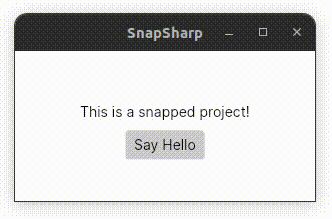

# SnapSharp

SnapSharp is a simple Avalonia .NET application that targets the Linux operating system. It's main _raison d'etre_ is to demonstrate how to package a .NET Linux desktop application into a [Snap](https://snapcraft.io).



## How to Build

1. Clone this repository
2. Build the Snap package with
```
$ snapcraft --debug --use-lxd
```
  - `--debug` to get a shell into the build container in case an error occurs mid-build.
  - `--use-lxd` to use a container as the build infrastructure.
3. Install the Snap on your system with
```
$ sudo snap install snap-sharp_0.1_amd64.snap --devmode
```
4. Run the app
```
$ snap-sharp
```

## Further Observations

### Multipass not working

Building this Snap with Multipass was not working with the following error:

```
launch failed: Remote "snapcraft" is unknown or unreachable.
```

I resorted to using LXD as an alternative, which worked flawlessly.

### Font family error

By the time I was done with the Snap package, the application was failing to launch with the following exception:
```
Unhandled exception. System.InvalidOperationException: Default font family name can't be null or empty.
```

As a workaround, I had to add the following NuGet packages to the `.csproj` project file (as per [this comment](https://github.com/AvaloniaUI/Avalonia/issues/9945#issuecomment-1377797867)):

```xml
<PackageReference Include="SkiaSharp.NativeAssets.Linux" Version="2.88.3" ExcludeAssets="all"/>
<PackageReference Include="SkiaSharp.NativeAssets.Linux.NoDependencies" Version="2.88.3" />
```